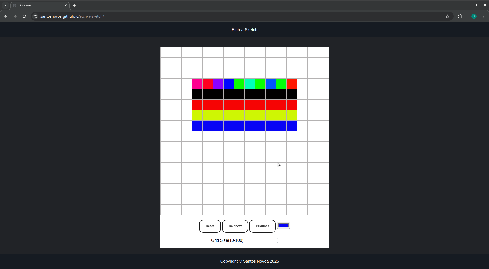

# Etch-a-Sketch Grid Drawing App 🎨



A browser-based drawing app inspired by the classic Etch-a-Sketch. You can draw on a grid with your mouse, pick colors, use rainbow mode, and toggle grid lines.

---

## 🚀 Features

- Click and drag to draw on the grid.
- Adjustable grid size (10 to 100 cells).
- Rainbow mode (random colors on draw).
- Custom color picker.
- Toggle grid lines on/off.
- Reset button to clear the grid.

---

## 🛠️ Technologies

- HTML
- CSS
- JavaScript (Vanilla)

---

## 📂 File Structure

---

## 🧠 How It Works

### `script.js`

- `createGrid(size)` – Builds the grid dynamically.
- `toggleGridLines()` – Toggles cell borders.
- `clearGrid()` – Clears all cell colors.
- `submitForm(e)` – Recreates the grid at user-defined size.
- `getRandomColor()` – Returns a random HSL color for rainbow mode.
- Event listeners handle mode changes, color input, and mouse interactions.

### Important Variables

- `currentColorMode` – Tracks current drawing mode (`"black"`, `"rainbow"`, `"custom"`).
- `isDrawing` – Boolean tracking whether the mouse is actively drawing.

---

## 🎨 Controls

| Feature        | Action                             |
|----------------|------------------------------------|
| Draw           | Click and drag over the grid       |
| Change Size    | Use the number input + submit      |
| Rainbow Mode   | Click the "Rainbow" button         |
| Custom Color   | Pick color using the color picker  |
| Toggle Borders | Click "Toggle Gridlines"           |
| Reset Grid     | Click the "Reset" button           |

---

## 🧪 Example Usage

```js
createGrid(16); // Initializes a 16x16 grid
currentColorMode = "rainbow"; // Enables rainbow coloring

